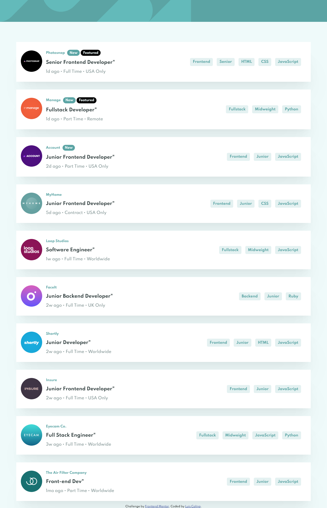

# Frontend Mentor - Job listings with filtering solution

This is a solution to the [Job listings with filtering challenge on Frontend Mentor](https://www.frontendmentor.io/challenges/job-listings-with-filtering-ivstIPCt). Frontend Mentor challenges help you improve your coding skills by building realistic projects. 

## Table of contents

- [Overview](#overview)
  - [The challenge](#the-challenge)
  - [Screenshot](#screenshot)
  - [Links](#links)
- [My process](#my-process)
  - [Built with](#built-with)
  - [What I learned](#what-i-learned)
  - [Continued development](#continued-development)

- [Author](#author)


## Overview

### The challenge

Users should be able to:

- View the optimal layout for the site depending on their device's screen size
- See hover states for all interactive elements on the page
- Filter job listings based on the categories

### Screenshot




### Links

- Solution URL: [Add solution URL here](https://github.com/Silkiercomet/static-job-listing-site)
- Live Site URL: [Add live site URL here](https://silkiercomet.github.io/static-job-listing-site/)

## My process

 I started bulding the hard HTML markup for the site wich turned out to not be that mucho because huge part of the rendered elements are made in the JS script, but i created a single job-container element and the header to have a basic understanding of his position in the site, i started this challenge using mobile first design strategy.
 
 Then i proceeded to create the pertient rules in the CSS to style the content, once they where defined y started working in the script that is the biggest and most important part of the project, this was my first time managing states, that was a challenge but i liked the final result and take pride on it  

### Built with

- Semantic HTML5 markup
- CSS custom properties
- Flexbox
- Mobile-first workflow
- JavaScript Object Notation
- Vanilla JavaScript

### What I learned

-- i learned a lot of the nature of async await this is the first time that i used asyncronous function in my
proyects and it was more easy that a though in first intance, ised to fetch data from the Json file that the challenge gives to you 

-- the property innerText gives the entire markup content of an element including his children elements, this was useful to filter the selected tags in the job container

-- this was one of the best challenges to practice DOM 

```js
async function fetchData(){
    try{
        let response = await fetch(`data.json`);
        return  response.json()
    }catch(err){
        console.error(err)
    }
}
```
```js
const removeContent = (x,y,z) => {
  for(let i = 0; i < y; i++){
    (document.querySelectorAll(x)[i].innerHTML == "false")? document.querySelectorAll(x)[i].style.display = 'none' : document.querySelectorAll(x)[i].innerHTML = z
  }
};
```

### Continued development

To make this content more dinamical i would like to create a function that send data to the json file 
so the user/admin would be able to add new content to the page

## Author

- Frontend Mentor - [@yourusername](https://www.frontendmentor.io/profile/Comet466)


